# Sơ đồ Cơ sở dữ liệu (ERD) - Hệ thống Quản lý CV (Recruitment Lifecycle) v2.3

Phiên bản cập nhật sử dụng khóa chính dạng **INT**, thêm các trường `username`, `rolecode`, `teamcode` vào bảng `USER_ROLES` để tối ưu truy vấn phân quyền.

```mermaid
erDiagram
    TEAMS ||--o{ USERS : "has members"
    TEAMS ||--o{ CANDIDATES : "is assigned to"
    TEAMS ||--o{ CV_HISTORY : "was assigned to"
    
    USERS ||--o{ USER_ROLES : "has"
    ROLES ||--o{ USER_ROLES : "assigned to"
    TEAMS ||--o{ USER_ROLES : "scoped to"

    ROLES ||--o{ ROLE_PERMISSIONS : "granted"
    PERMISSIONS ||--o{ ROLE_PERMISSIONS : "assigned via"
    
    CANDIDATES ||--o{ CV_HISTORY : "has history log"
    USERS ||--o{ CV_HISTORY : "changed state of"
    
    CANDIDATE_ROLES ||--o{ CANDIDATES : "applies for"
    CV_STATES ||--o{ CANDIDATES : "is currently at"
    CV_STATES ||--o{ CV_HISTORY : "transitions to/from"
    SCHOOLS ||--o{ CANDIDATES : "studied at"

    TEAMS {
        int id PK "Mã định danh duy nhất của Team"
        string team_code "UNIQUE - Mã code của Team (VD: TEAM_A)"
        string name "UNIQUE - Tên hiển thị của Team"
        text description "Mô tả chi tiết về Team"
        timestamp created_at "Thời gian tạo"
        timestamp updated_at "Thời gian cập nhật cuối"
        timestamp deleted_at "Soft Delete - Thời gian xóa mềm"
    }

    ROLES {
        int id PK "Mã định danh duy nhất của Role"
        string role_code "UNIQUE - Mã nhóm quyền (VD: HR, MANAGER)"
        string name "Tên hiển thị của nhóm quyền"
        timestamp created_at "Thời gian tạo"
        timestamp updated_at "Thời gian cập nhật cuối"
        timestamp deleted_at "Soft Delete"
    }

    PERMISSIONS {
        int id PK "Mã định danh duy nhất của Permission"
        string permission_code "UNIQUE - Mã quyền chi tiết (VD: VIEW_SALARY)"
        string name "Tên hiển thị của quyền"
        timestamp created_at "Thời gian tạo"
        timestamp updated_at "Thời gian cập nhật cuối"
        timestamp deleted_at "Soft Delete"
    }

    ROLE_PERMISSIONS {
        int role_id FK "Liên kết tới bảng ROLES"
        int permission_id FK "Liên kết tới bảng PERMISSIONS"
    }

    USER_ROLES {
        int id PK "Mã định danh duy nhất của record"
        int user_id FK "Liên kết tới bảng USERS"
        string username "Denormalized - Tên đăng nhập của user để truy vấn nhanh"
        int role_id FK "Liên kết tới bảng ROLES"
        string role_code "Denormalized - Mã quyền (VD: HR, MANAGER)"
        int team_id FK "Nullable - Liên kết tới bảng TEAMS (Null nếu là quyền Global như HR)"
        string team_code "Nullable - Denormalized - Mã Team"
    }

    USERS {
        int id PK "Mã định danh duy nhất của User"
        string username "UNIQUE - Tên đăng nhập"
        string password_hash "Mật khẩu đã được mã hóa"
        string full_name "Họ và tên đầy đủ"
        timestamp created_at "Thời gian tạo"
        timestamp updated_at "Thời gian cập nhật cuối"
        timestamp deleted_at "Soft Delete"
    }
    
    CANDIDATE_ROLES {
        int id PK "Mã định danh duy nhất của Vị trí tuyển dụng"
        string role_code "UNIQUE - Mã vị trí (VD: ARTIST, DEV)"
        string name "Tên vị trí tuyển dụng"
        timestamp created_at "Thời gian tạo"
        timestamp updated_at "Thời gian cập nhật cuối"
        timestamp deleted_at "Soft Delete"
    }
    
    CV_STATES {
        int id PK "Mã định danh duy nhất của Trạng thái"
        string state_code "ENUM/UNIQUE - Mã trạng thái (VD: Sourcing, HR_Screening)"
        string name "Tên hiển thị của trạng thái"
        int display_order "Thứ tự hiển thị trên UI (Progress Flow)"
        timestamp created_at "Thời gian tạo"
        timestamp updated_at "Thời gian cập nhật cuối"
        timestamp deleted_at "Soft Delete"
    }

    SCHOOLS {
        int id PK "Mã định danh duy nhất của Trường học"
        string school_code "UNIQUE - Tên viết tắt của trường (VD: HUST)"
        string name "Tên đầy đủ của trường"
        timestamp created_at "Thời gian tạo"
        timestamp updated_at "Thời gian cập nhật cuối"
        timestamp deleted_at "Soft Delete"
    }

    CANDIDATES {
        int id PK "Mã định danh duy nhất của Ứng viên"
        string name "Họ và tên ứng viên"
        string email "Địa chỉ Email"
        string phone "Số điện thoại liên hệ"
        string cv_file_path "Đường dẫn lưu trữ file CV trên server/cloud"
        string cv_original_name "Tên file CV gốc lúc upload"
        int cv_file_size "Dung lượng file CV (bytes)"
        int school_id FK "Nullable - Liên kết tới bảng SCHOOLS. Trường học của ứng viên"
        string demo_link "Nullable - Link Portfolio hoặc Demo sản phẩm"
        int role_id FK "Liên kết tới bảng CANDIDATE_ROLES. Vị trí ứng tuyển"
        int current_state_id FK "Liên kết tới bảng CV_STATES. Trạng thái hiện tại của CV"
        decimal salary_offer "Mức lương đề xuất (Chỉ HR được xem)"
        int assigned_team_id FK "Nullable - Liên kết tới bảng TEAMS. Team đang quản lý CV này"
        timestamp created_at "Thời gian tạo"
        timestamp updated_at "Thời gian cập nhật cuối"
        timestamp deleted_at "Soft Delete"
    }

    CV_HISTORY {
        int id PK "Mã định danh duy nhất của History Log"
        int candidate_id FK "Liên kết tới bảng CANDIDATES. CV được thay đổi"
        int changed_by_user_id FK "Liên kết tới bảng USERS. User thực hiện thay đổi"
        int previous_state_id FK "Nullable - Trạng thái trước (Dùng cho Funnel)"
        int new_state_id FK "Nullable - Trạng thái mới (Dùng cho Funnel)"
        string action_type "Loại hành động (VD: CHANGE_STATE, UPDATE_INFO, ASSIGN_TEAM)"
        jsonb changes_payload "JSONB: Lưu toàn bộ sự thay đổi (Generic Audit)"
        text change_reason "Lý do thay đổi (VD: Lý do reject)"
        timestamp created_at "Thời gian tạo log"
    }
```

